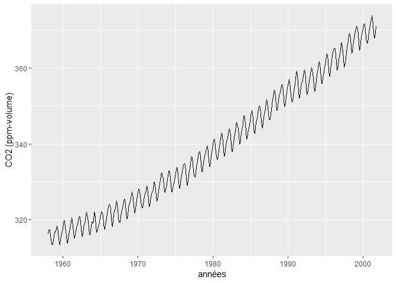
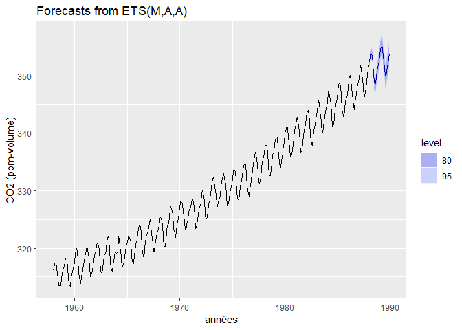
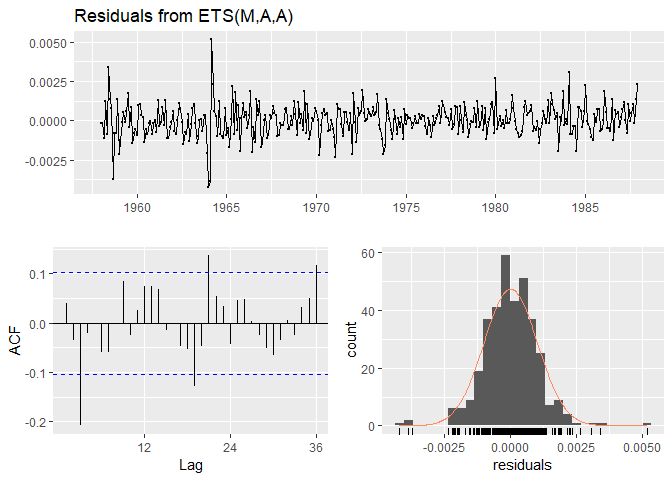

Devoir 5
================
lelia anderson
2019-04-05

La version ouverte de ce travail est disponible à l'[adresse suivante](https://github.com/leliaanderson/GAE-7007.git)

Étapes préliminaires
====================

Chargement des modules, lecture du **.csv** et ajustement de la date.

``` r
rm(list=ls())

library(readr)
library(forecast)
```

    ## Warning: package 'forecast' was built under R version 3.5.3

``` r
library(tidyverse)
library(lubridate)

hawai<-read_csv("hawai.csv") #lecture csv
hawai$time=format(date_decimal(hawai$time), "%Y-%m-%d") #ajustement date
```

Création d'une série temporelle du CO2
======================================

La série temporelle est créée.

``` r
hawai_ts<-ts(hawai %>% select(-time), 
   start=c(hawai$time[1] %>% year(), 1 ), #début à l'année 1958, et au 1er mois 
   frequency=12) #frequency = 12, car 12 mois par années et qu'on a 1 mesure par mois
```

Le graphique illustrant la série temporelle est créé.

``` r
autoplot(hawai_ts)+labs(x="années", y ="CO2 (ppm-volume)") #visualisation générale
```



La série temporelle illustrée ci-dessus permet de constater que les moyennes des mesures mensuelles de CO2 atmosphérique fluctuent annuellement et ont suivi une tendance à la hausse sur la période mesurée 1958-2001.

Séparation de la série en parties d'entraînement
================================================

Pour l'entraînement, 70% des données sont sélectionnées :

(2001 − 1958)\*0.70 = 30.1*a**n**s*

La portion des données utilisées pour l'entraînement sera 1958-1987 (inclusivement) et la portion utilisée pour le test sera 1988-2001.

``` r
hawai_ts_train<-window(hawai_ts, start = 1958, end = 1987.9999) # données d'entraînement
#hawai_ts_train1<-window(hawai_ts, end = c(1987, 12)) #données d'entraînement, autre méthode

hawai_ts_test<-window(hawai_ts, start = 1988) #données de test
```

Création d'un modèle ETS sur les données d'entraînement, et projection la prévision de CO2 atmosphérique pour comparer aux données test
=======================================================================================================================================

Le modèle et la prédiction sont générés repectivement.

``` r
hawai_ets<-hawai_ts_train %>% ets() #générer le modèle
hawai_fc<-hawai_ets %>% forecast #obtenir la prédiction
```

Le graphique est généré.

``` r
hawai_fc %>% autoplot()+labs(x="années", y ="CO2 (ppm-volume)")
```



La figure ci-dessus montre que les intervals de confiance 80% et 95% illustrées dans les régions bleutées sont très rapprochées des valeurs "test".

Analyse des résidus
===================

Afin de pouvoir commenter le modèle, une analyse des résidus est effectuée.

``` r
checkresiduals(hawai_ets) #analyse des résidus
```



    ## 
    ##  Ljung-Box test
    ## 
    ## data:  Residuals from ETS(M,A,A)
    ## Q* = 47.306, df = 8, p-value = 1.341e-07
    ## 
    ## Model df: 16.   Total lags used: 24

Commentaires généraux sur l'analyse des résidus
-----------------------------------------------

Les observations générales sont faite suite à l'analyse des résidus présentée au graphique ci-dessus.

-   Visuellement les résidus semblent se comporter comme un bruit blanc dans le graphique du haut.
-   Le graphique d'auto-corrélation monte qu'il y a une certaine auto-corrélation du bruit blanc à chaque "environ 4".
-   Il y a un pic de variance autour de l'année 1964. À cette date, le graphique du CO2 en fonction du temps montre aussi une fluctuation semblant "irrégulière".
-   Il y a un résidu systématiquement corrélé entre le 0 et le 4 (environ).
-   Le graphique de la distribution des résidus ci-dessus semble montrer des valeurs aberrantes.

Vérification de la normalité des résidus
----------------------------------------

Pour que les valeurs prédites soient crédibles, les résidus doivent être distribués normalement. Les tests de *Shapiro-Wilk* et de *Kurtosis* sont respectivement effectués pour vérifier la normalité.

``` r
shapiro.test(residuals(hawai_ets)) # test Shapiro-Wilk
```

    ## 
    ##  Shapiro-Wilk normality test
    ## 
    ## data:  residuals(hawai_ets)
    ## W = 0.96697, p-value = 2.813e-07

``` r
e1071::kurtosis(residuals(hawai_ets), na.rm=T)  # test de kurtosis
```

    ## [1] 3.060895

La *p value* du test de *Shapiro-Wilk* étant de 1.341*e* − 07 (largement inférieur à 0.05), il est peu probable que les résidus forment un bruit blanc. De plus, la normalité vérifée avec le test de *Kurtosis* donnant une valeur de 3.060895 (une distribution normale devrait être de 0), montre que la distribution des résidus n'est pas normale.

Le modèle est-il fiable? Comment pourrait-il être amélioré?
===========================================================

Fiabilité?
----------

Une analyse d'exactitude est faites.

``` r
accuracy(hawai_fc, hawai_ts) #analyse d'exactitude
```

    ##                       ME      RMSE       MAE         MPE      MAPE
    ## Training set 0.007597486 0.3326695 0.2484365 0.001821539 0.0755693
    ## Test set     0.254890334 0.3690552 0.2891617 0.072118087 0.0818767
    ##                   MASE       ACF1 Theil's U
    ## Training set 0.2085386 0.03973964        NA
    ## Test set     0.2427235 0.32235526 0.3023005

``` r
summary(hawai_ets)
```

    ## ETS(M,A,A) 
    ## 
    ## Call:
    ##  ets(y = .) 
    ## 
    ##   Smoothing parameters:
    ##     alpha = 0.7003 
    ##     beta  = 1e-04 
    ##     gamma = 1e-04 
    ## 
    ##   Initial states:
    ##     l = 314.7353 
    ##     b = 0.0957 
    ##     s = 0.5685 -0.0302 -0.9176 -1.9974 -3.0677 -2.8475
    ##            -1.1918 0.7283 2.2464 2.8286 2.3606 1.3198
    ## 
    ##   sigma:  0.001
    ## 
    ##      AIC     AICc      BIC 
    ## 1365.555 1367.345 1431.619 
    ## 
    ## Training set error measures:
    ##                       ME      RMSE       MAE         MPE      MAPE
    ## Training set 0.007597486 0.3326695 0.2484365 0.001821539 0.0755693
    ##                   MASE       ACF1
    ## Training set 0.2085386 0.03973964

La RMSE ayant une valeur nettement inférieure à l'amplitude des valeurs de CO2 mesurées montre que l'exactitude du modèle est bonne. Il est aussi intéressant de constater qu'il y a peu de différentes entre les valeurs de RMSE d'entraînement et de test, cela témoigne également de la bonne performance du modèle.

Possiblité d'amélioration?
--------------------------

D'un autre côté, comme la distribution des résidus n'est pas normale, et qu'il y a un résidu systématiquement corrélé entre le 0 et le 4 (environ), il pourrait exister une structure dans les données qui n'a pas été capturée par le modèle et du travail pourrait encore être fait pour tenter d'améliorer le modèle.

Comme l'évolution du CO2 tient surment compte d'une série de covariables explicatives liées à l'environnement (et pas seulement à l'effet du temps), le modèle pourrait être amélioré en accueillant des covariables qui modélisent le terme d'erreur en fonction de séries temporelles conjointes. ARIMA pourrait par exemple être utilisé pour y parvenir.
